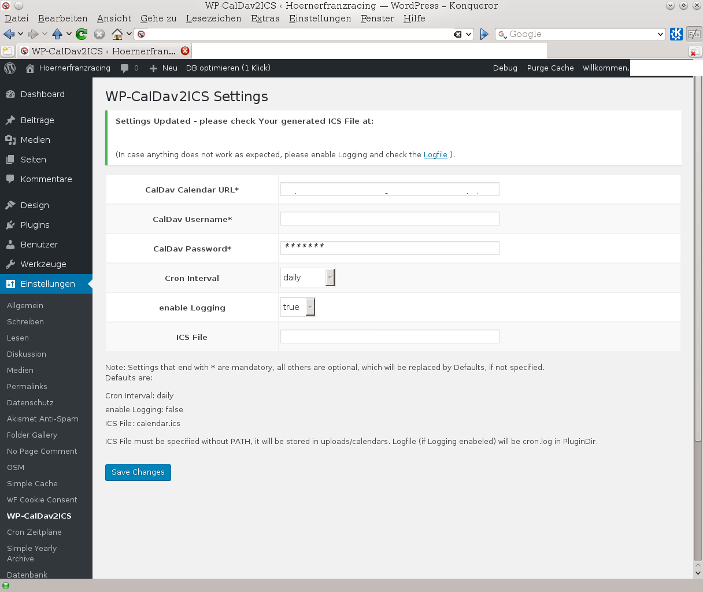
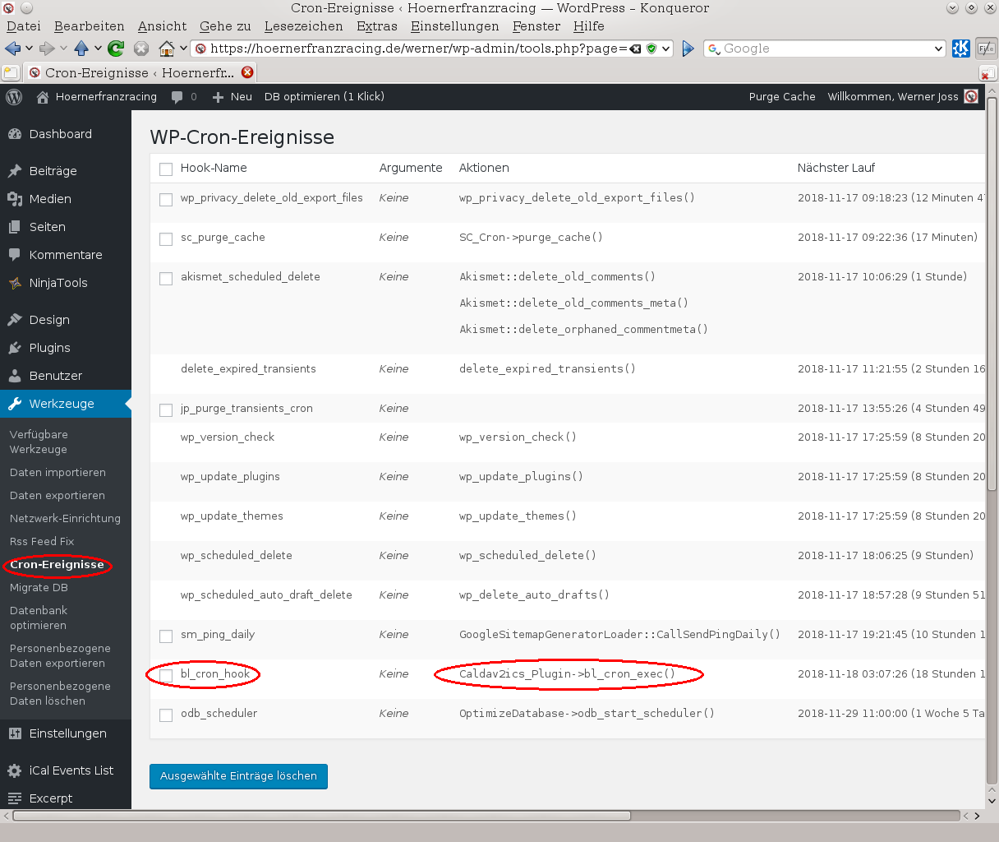
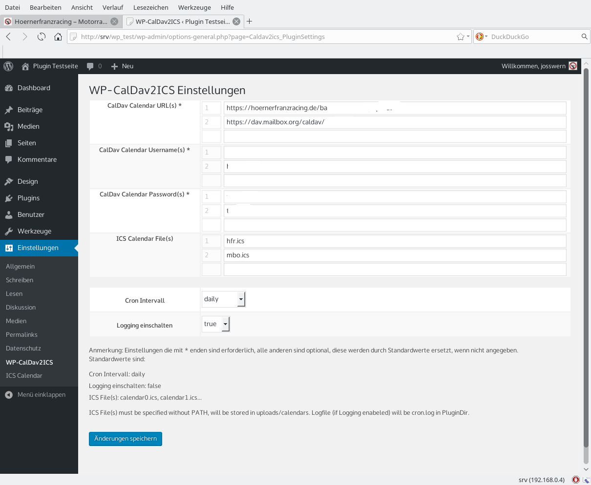

## Automatically create ICS File from CalDav Calendar

## please note that this Plugin is no longer supported an will be archived soon, as I have given up on Grav development since my switch to [Hugo](https://gohugo.io) in 2024.

### Description

Ever thought about to use your (remote) CalDav Calendar(s) as an automatic data source for your favourite WP Calendar Plugin ?
Searched for a Plugin that would provide this functionality in the WP Plugins Directory and found nothing useful ?
Well, in case of 'Yes' to both questions, this is for You :smile:.  
Just read the whole story at [https://hoernerfranzracing.de/werner/kde-linux-web/wp-caldav2ics](https://hoernerfranzracing.de/werner/kde-linux-web/wp-caldav2ics) to check out if this will fit your needs...  
And yes, Calendar(s) is correct from Version 1.1.0 - you are no longer limited to just ONE Calendar Source !

### Installation
FROM YOUR WORDPRESS DASHBOARD

1. Visit ‘Plugins > Add New’
2. Search for ‘wp-caldav2ics’, select 'Install'
3. Activate wp-caldav2ics from your Plugins page.
4. Go to the Plugin Admin Page and provide the required Settings, then press 'Save Changes'
5. Check correct working ( = ICS File created from your CalDav Calendar at the desired Intervals)
6. If anything goes wrong, re-check your Settings, enable Logging, check WP Cron Events to have bl_cron_hook running as planned, use [wp-crontrol](https://wordpress.org/plugins/wp-crontrol) (or similar Plugin) for that

FROM WORDPRESS.ORG

1. Download wp-caldav2ics.zip .
2. Unpack the downloaded zip File and upload the ‘wp-caldav2ics’ directory to your ‘/wp-content/plugins/’ directory, using your favorite method (ftp, sftp, scp, etc…)
3. proceed with Steps #3 to #6 from above

FROM GITHUB.COM

1. git clone https://github.com/wernerjoss/wp-caldav2ics
2. Upload Directory wp-caldav2ics to your WP Installion,  usually 'wp-content/plugins'
3. proceed with Steps #3 to #6 from above

Alternatively, you can also download the zip File from the GitHub Page, but note: this one will be named wp-caldav2ics-master.zip
and will unpack to a folder named wp-calda2ics-master.
This will have to be renamed to wp-caldav2ics before uploading !
In case your Installation is from the WP Directory and you want to try the Development Version from 
GitHub zip Download, you can also just upload all Files (including those in Subdirectories!) from the unpacked Folder wp-calda2ics-master to wp-content/plugins/wp-caldav2ics

### Screenshots

1. Plugin Admin Page: 
2. WP Cron Page:  
3. New Multi-Calendar Feature (from Version 1.1.0):  

For additional Information, please refer to the [WP readme.txt File](./readme.txt)

### Additional Notes
As I'm currently using [Grav](https://getgrav.org) as my favourite CMS, alternatively [Contao](https://contao.org), I won't do any more Plugin Development for Wordpress.  
This Plugin is just a Leftover and get some Attention from Time to Time, but there is no Guarantee.  
However, this Repo on GitHub will for sure exist longer than that in the [WP Repo](https://wordpress.org/plugins/wp-caldav2ics/) which will probably be deleted at some Point in the Future (e.g. when WP will change their API significantly).
